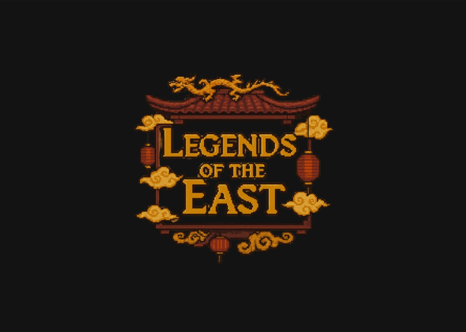
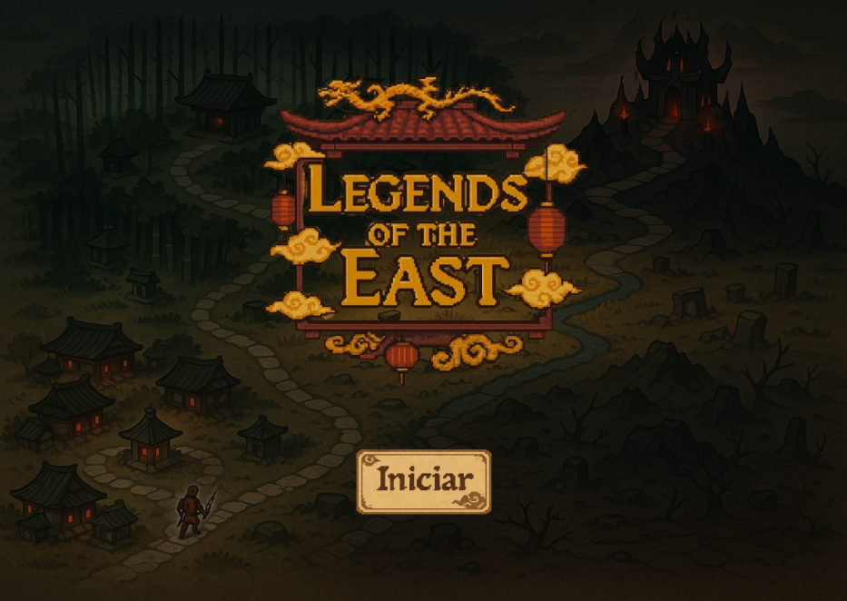
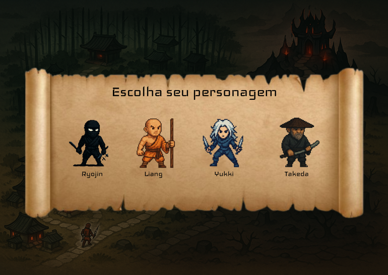
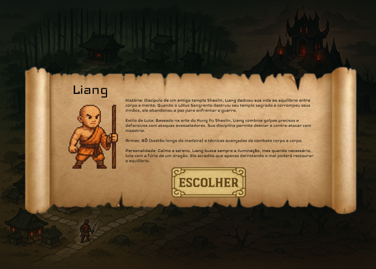
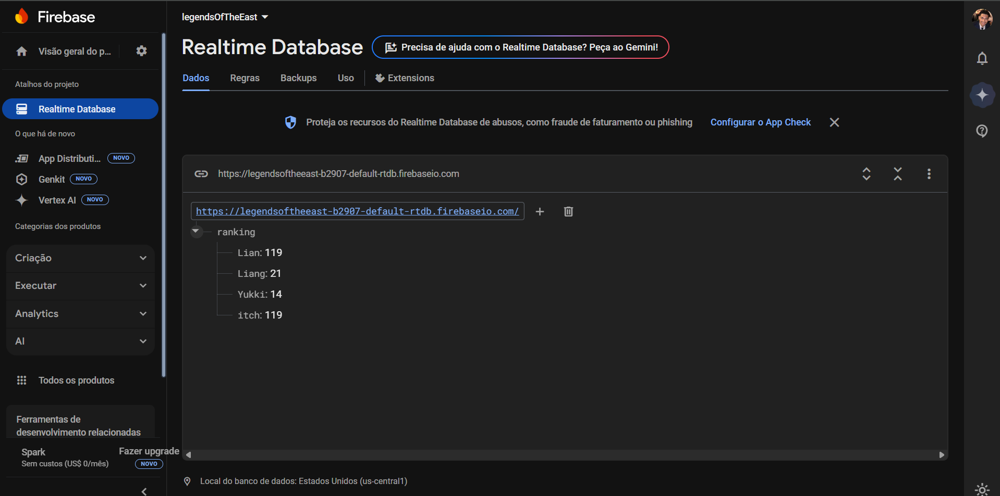

<h1 align="center">Legends of The East</h1>

  <strong> 🐉 ⛩️ 🥷  </strong>

 

  Um game com estética oriental incrível, construído com a plataforma de programação em blocos Construct 3!

 ## 🗡️ Enredo
    
Em uma era esquecida pelo tempo, onde guerreiros enfrentavam deuses e lendas ganhavam vida, uma força sombria desperta. A organização secreta Lótus Sangrento, há séculos operando nas sombras, finalmente completa um ritual profano — libertando Oni no Kuro, o temível Demônio Samurai que quase destruiu o Oriente.

Você é um guerreiro de espírito indomável, a última esperança contra esse mal. Escolha seu caminho:

- ⚔️ Samurai destemido

- 🔥 Monge disciplinado

- 🥷🏿 Ninja mortal

Cada decisão moldará sua jornada na batalha contra as trevas.

## 🗃️ Documentações

> [!IMPORTANT]
> O jogo disponível no link abaixo é uma versão beta de Legends of the East.
>Abaixo, você encontrará o escopo completo do projeto, incluindo o enredo completo e todos os detalhes planejados para a versão final.

> [!NOTE]
>📃 Link Documentação: https://cultured-dash-e1d.notion.site/Legends-of-the-East-1c88cd950f3580e3ab32f721597d3784?pvs=4

## 👾 Imagens da aplicação

    
    
    
    

## 📊 Banco de dados

> [!IMPORTANT]
>Utilizei o banco de dados NoSQL Firebase, abaixo temos um print com o ranking, o qual recebe os dados do game e os envia para exibição da lista dos pontuadores.

    

##  🌐 Link da aplicação

> [!NOTE]
>Link da aplicação: https://depaula06.itch.io/legendsoftheeast